# POC ODATA
## 1.Arranque
Para arrancar el proyecto solo se necesita cambiar el connection-string de la bbdd (la bbdd se crea ya que es code first)
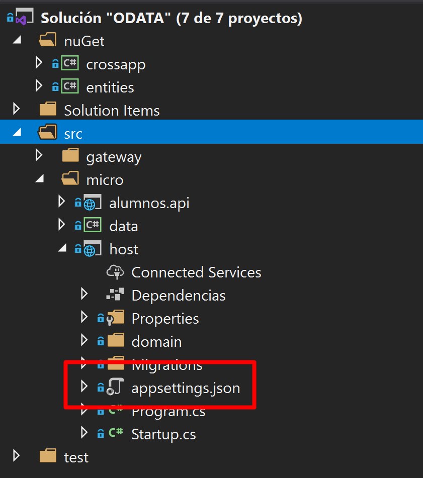
Ya por otro lado, habría que arrancar los dos proyectos que se indican a continuación
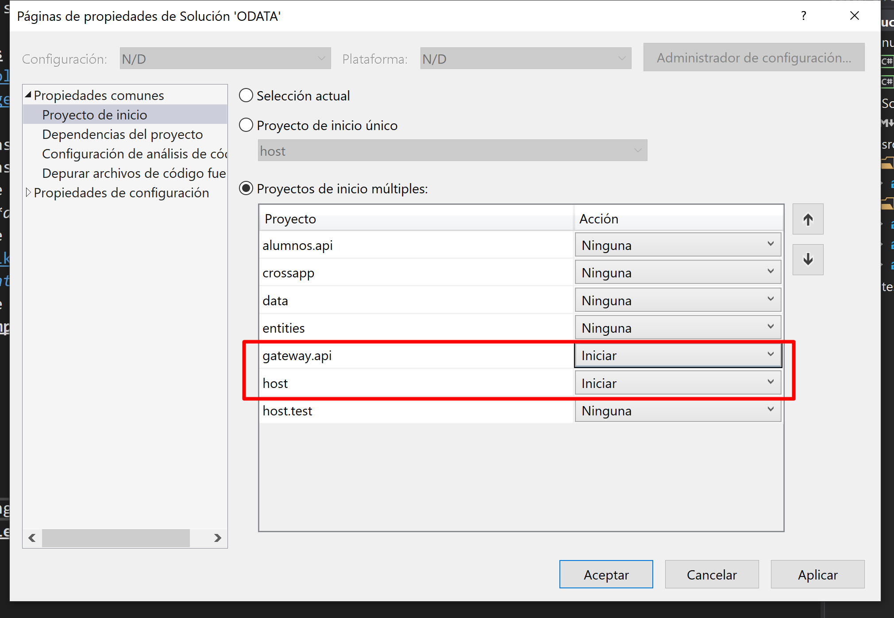
### 1.1.Pruebas a controladores
* https://www.getpostman.com/collections/e93903519b2d848e88f2
* https://localhost:44307/swagger
## 2.Arquitectura
La arquitectura propuesta se basa en los siguientes conceptos:
* __Api restfull__: Mediante las llamadas GET/POST/PATCH/PUT/DELETE se crea de forma intuitiva toda la funcionalidad
* __ODATA__: Mediante el uso de entity framework y odata, se pemiten hacer busquedas por cabecera. *ej: Alumnos que ocmiencen por M*, sin implementar código
* __CQRS__: Utilización de un *dataContext* ligero para búsquedas y en otro pesado para mantenimiento
* __.net core__: Dado que tiene su propio motor de IOC, permite inyectar en los diferentes controladores los objetos de dominio, de tal maneta que se separa la arquitectura de la funcionalidad.  Por otro lado al poder diferenciarse la capa HOST de la capa API, permite diferentes configuraciones o agrupaciones, aumentando así la capa de diferenciación en DDD. Comentar además, que al estar basado en core es multiplataforma, modular (solo se trae lo que necesita), orientado a los comandos (todo una ventaja para devops) y __está orientado al rendimiento y a microservicios__
* __DDD__: ([ref](https://es.wikipedia.org/wiki/Dise%C3%B1o_guiado_por_el_dominio)) Usando los beneficios de la arquitectura hexagonal, el modelo vendría dado por interfaces diseñadas en *crossapps* y cada aplicación implementaría su propio dominio.
* __POA__: *[Programación orientada a aspectos](https://es.wikipedia.org/wiki/Programaci%C3%B3n_orientada_a_aspectos)* (en inglés: aspect-oriented programming) es un paradigma de programación que permite una adecuada modularización de las aplicaciones y posibilita una mejor separación de responsabilidades (Obligación o correspondencia de hacer algo).
* __CODE FIRST__: El sistema se despliegua automáticamente, y crea/modifica la base de datos en el acto.
### 2.1.Principios de diseño implementados
* KISS
* YAGNI
* DRY
* POLA
* S.O.L.I.D.
* CQS
* IOC
* LoD o "don't talk with extrangers"
### 2.2.Patrones de diseño implementados
* UnitOfWork
* Repository
* CQRS
* Inyección de dependencias
* Template
### 2.3.Llamadas a la api
#### 2.3.1.GET
Se basa en ODATA + EntityFramework (cliente ligero)
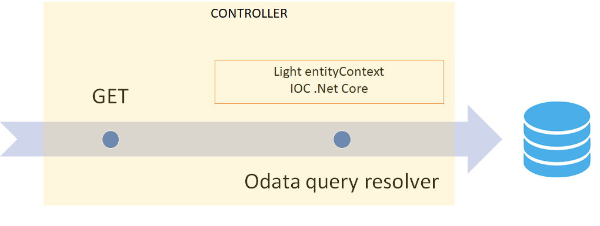
#### 2.3.2.Llamadas para modificaciones
En este caso se usa el cliente pesado, que permite la trazabilidad de objetos
##### 2.3.2.1.POA en este contexto
Mediante el IOC, se establacen las siguientes interfaces
* Reglas: Tiene que ver con la aceptación de entidades antes de insertar/modificar. *ej: ¿EL usuario es mayor de edad?¿El nombre viene relleno??*
* Transformaciones: Hace referencia al trato especializado de una entidad según el negocio. *ej: ¿Cómo se genera la facturación en Chile?¿Cómo se calcula el descuento?*
* Acciones de Base de Datos: Su especialización trata en comprobaciones de tablas/campos para lanzar dentro de una transacción. *ej: Controles de concurrencia. Acceso a sistemas externos*

##### 2.3.2.2.POST/PUT/PATCH
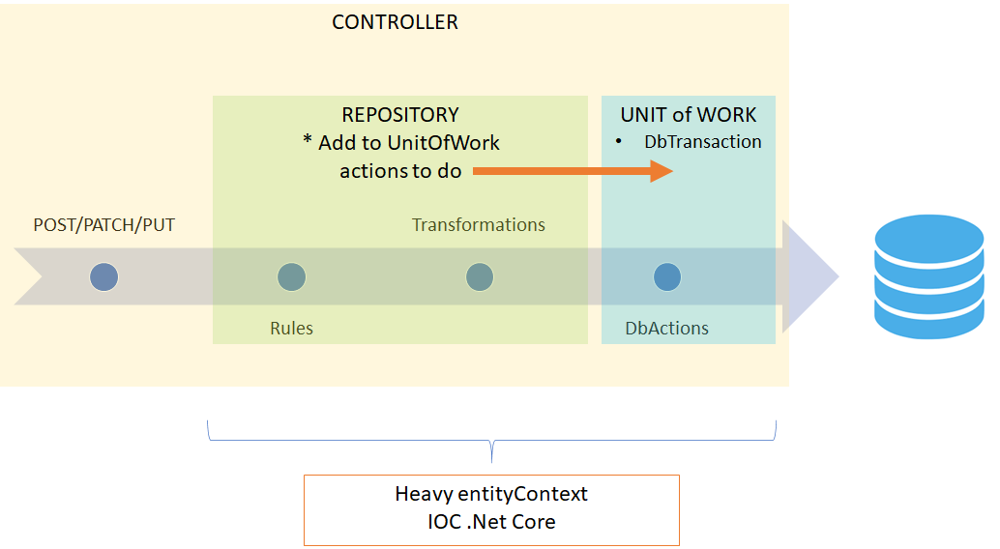
1. Lo primero, una vez que llega la entidad a petición se ejecuta la validez del modelo, si va todo bien pasamos el siguiente paso
2. El controlador pide al __repositorio__ que añada/modifique una nueva entidad
* Se ejecutan las reglas
* Se aplican las transformaciones
* Se añaden las acciones al unitOfWork
3. Se lanza UnitOfWork, que engloba los cambios sobre BBDD y las acciones añadidas desde el repositorio

##### 2.3.2.3.DELETE
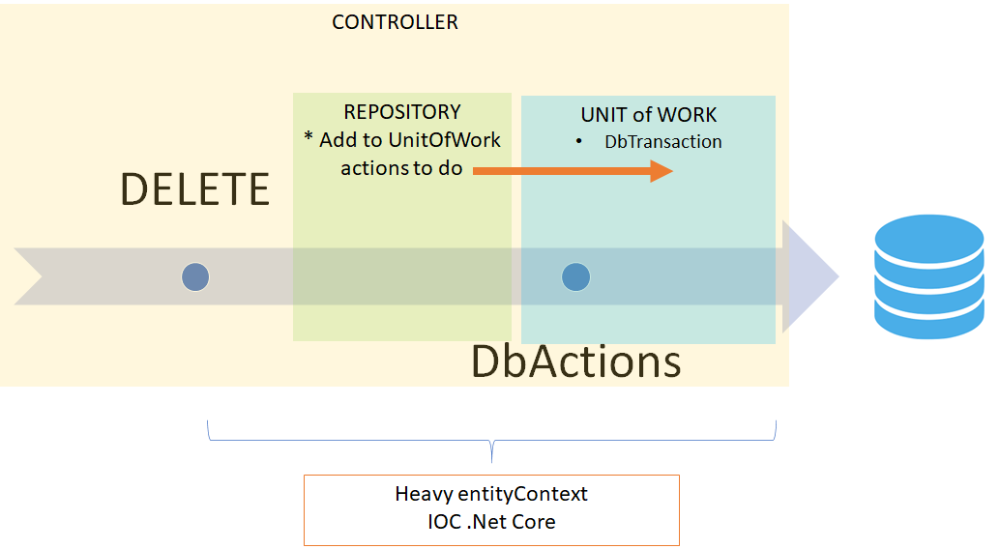
1. El controlador pide al __repositorio__ que borre una nueva entidad
* Se añaden las acciones al unitOfWork
3. Se lanza UnitOfWork, que engloba los cambios sobre BBDD y las acciones añadidas desde el repositorio

### 2.4.Proyectos en este entorno
#### 2.4.1.NuGets
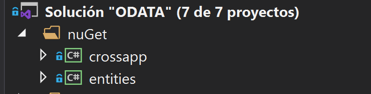
* CrossApp: Interfaces que hacen de modelo, sirve para la comunicación entre todos los NuGets y aplicativos
* Entities: Entidades de base de datos
#### 2.4.2.MicroServicio
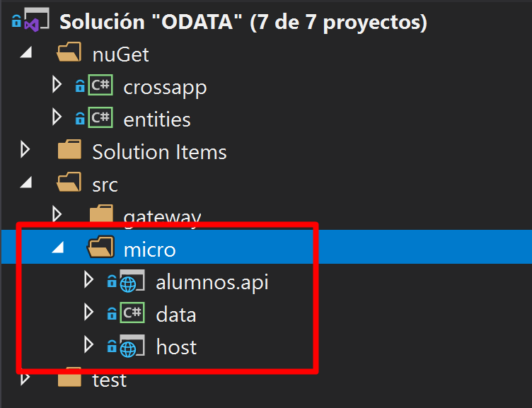
Dado que estamos en .net core, nos permite diferenciar entre el host y los controladores. De este modo podemos tener diferentes HOST con diferenets configuraciones o agrupaciones.
* Data: Contiene el contexto de "Entity Framework", tanto el cliente ligero como el pesado
* Alumnos.api: Se generan los controladores (Todos heredan de una clase BASE, por lo que el código es mínimo o en *override*)
* Host: Contiene la inyección de dependencias (y el dominio) que se realiza en el *startup.cs*
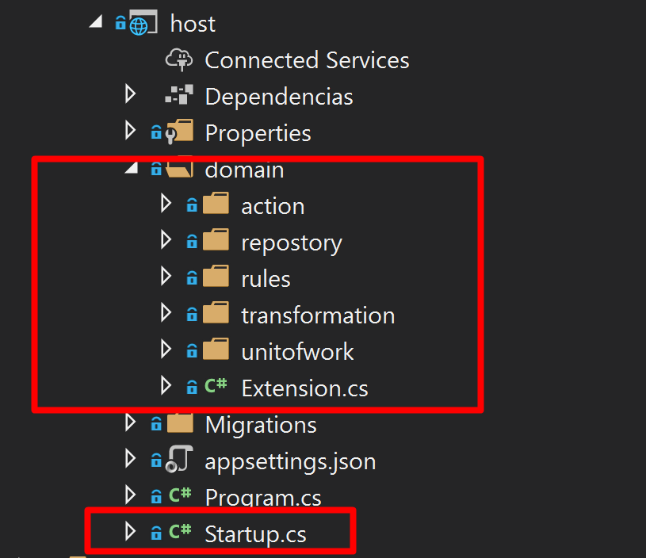
NOTA: El dominio podría ir en un paquete a parte y cargarlo dirante el proceso de DevOps
#### 2.4.3.GateWay
Prueba de concepto de *api gateway* que permite fusionar varios microservicios

Se han creado varias queries como prueba de concepto

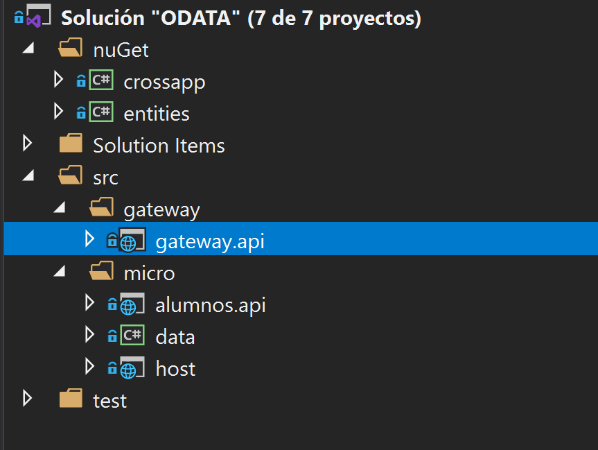

##### 2.4.3.1.Cómo crear referencias a un servicio ODATA
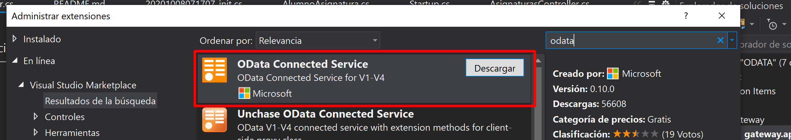
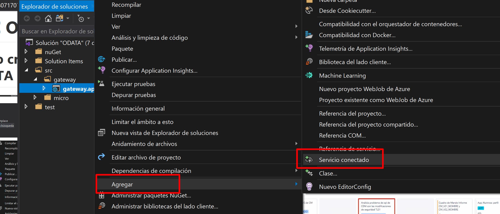
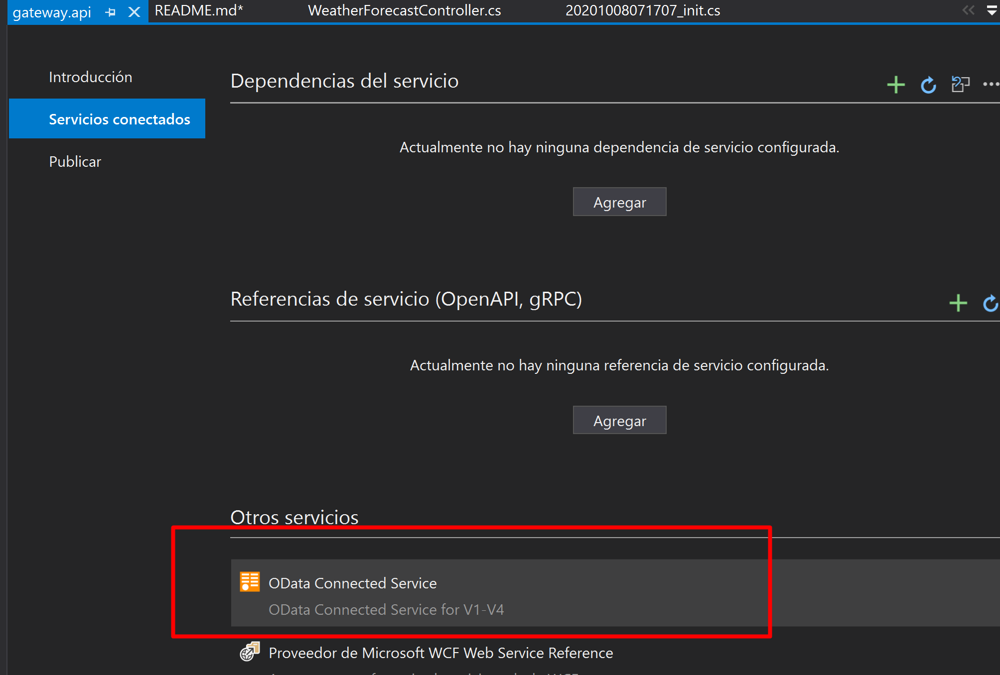

## 3.Beneficios
* __IOC__: Dada la arquitectura propuesta, los paquetes de reglas/transformaciones/acciones se pueden desplegar como un punto de DevOps, de tal manera que se pueden implementar a parte.
* __AGILE__: El modelo presenta una "agilidad" sin igual gracias a la suma de POA + IOC + ODATA
* __Code First__: El despliegue es automático, ideal para levantar y "tirar" microservicios, orientado a la eficiencia y a la multiplataforma.

## 4.TODO
* Que los archivos de MIGRATION de Code-first vayan dentro del proyecto de data
* Temas de autenticación y permisos
* Temas de identificación del usuario

## 5.Estimación de tiempos
En este apartado se pretende hacer una estimación de tiempo (lo más real posible) para terminar de entender los beneficios del modelo.
* ¿Qué hago si necesito añadir un nuevo controlador y una nueva entidad?
1. Creamos la entidad en *entities*
2. Añadimos la entidad en *data*, a modo de colección en el context
3. Lanzamos una nueva migración con *"add-migration XXX"* 
4. Creamos un controlador en *alumnos.api* y que hereda de base
5. Creamos las reglas, acciones y transformaciones en *host*, y añadimos la inyección en *host/startup.cs*
 __TOTAL:__ *max 1 hora* (con despliegue de base de datos incluido)

* ¿Qué hago si necesito añadir una nueva regla de comprobación antes de guardar?
1. Añadimos la regla en *host/domain/\<entity>/rules*
2. Añadimos la inyección en *host/domain/extension*
 __TOTAL:__ *max 10 min*

* ¿Qué hago si necesito añadir una una nueva acción sobre una entidad, por ejemplo, modificar la fecha de acceso?
1. Añadimos la transformación en *host/domain/\<entity>/transformations*
2. Añadimos la inyección en *host/domain/extension*
 __TOTAL:__ *max 10 min*

* ¿Qué hago si necesito añadir un nuevo campo en una tabla?
1. Modificamos la entidad en *entities*
2. Lanzamos una nueva migración con *"add-migration XXX"* 
 __TOTAL:__ *max 10 min* (con despliegue de base de datos incluido)

## 6.REFS
* https://www.odata.org/documentation/odata-version-2-0/uri-conventions/
* https://docs.microsoft.com/en-us/odata/
* https://www.campusmvp.es/recursos/post/10-diferencias-entre-net-core-y-net-framework.aspx
* https://docs.microsoft.com/es-es/dotnet/standard/choosing-core-framework-server
